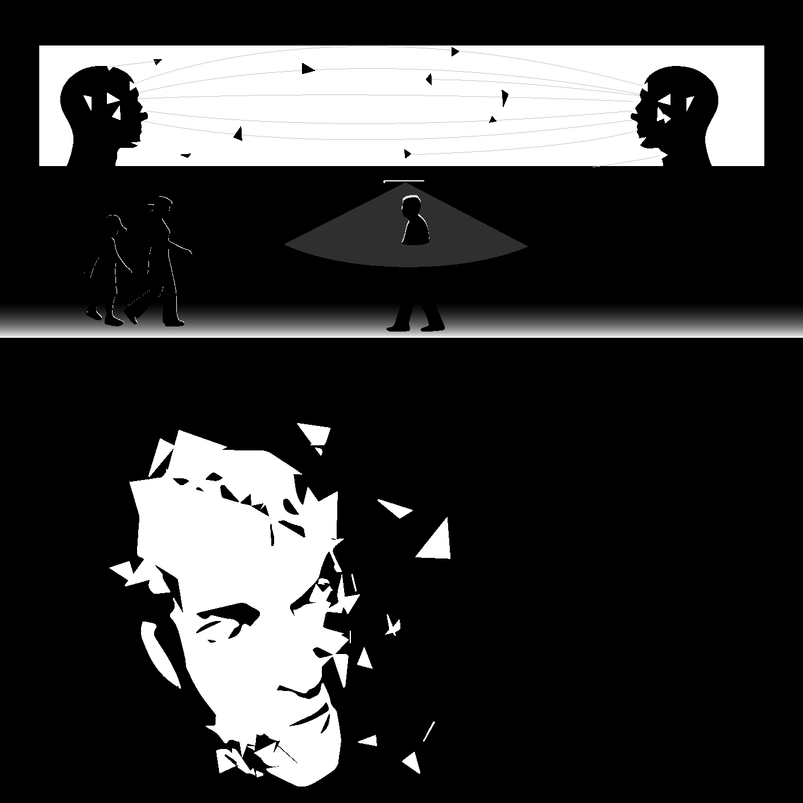

# Window Project



Projection installation project in downtown Atlanta. Uses a custom [openFrameworks](https://openframeworks.cc) application running on 2 CPUs and 6 projection screens.

## Installation Notes

### Fullscreen Windowing Across Multiple Displays

main.cpp:

```cpp
#include "ofMain.h"
#include "ofApp.h"
#include "ofAppGLFWWindow.h"

//========================================================================
int main( ){
    
    ofAppGLFWWindow window;
    window.setMultiDisplayFullscreen(true);
	ofSetupOpenGL(&window, 1024,768,OF_WINDOW);			// <-------- setup the GL context
	// this kicks off the running of my app
	// can be OF_WINDOW or OF_FULLSCREEN
	// pass in width and height too:
	ofRunApp(new ofApp());

}
```
"Displays have separate Spaces" must be disabled in System Preferences > Mission Control Preferences	on OSX 10.8/10.9.

More info openFrameworks forum [here](http://forum.openframeworks.cc/t/spanning-multiple-displays-as-a-single-canvas-on-os-x-10-8-10-9/16209) and [here](http://forum.openframeworks.cc/t/window-bigger-than-screen-in-of-v0-8-0-and-vertical-sync/13321/4).

